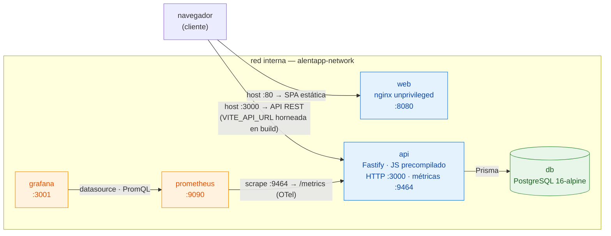
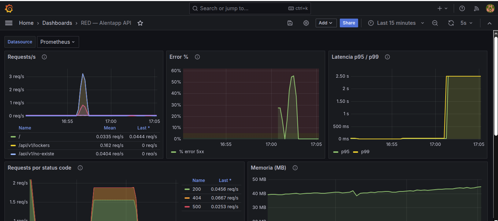
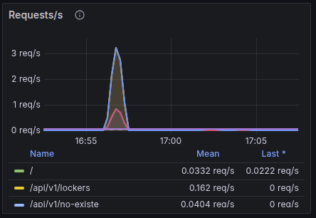
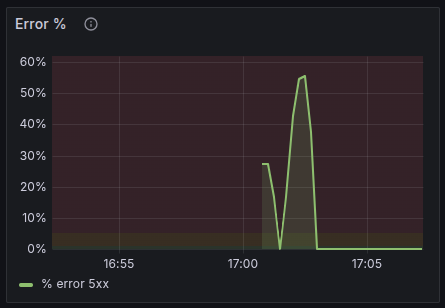
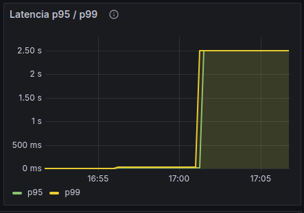
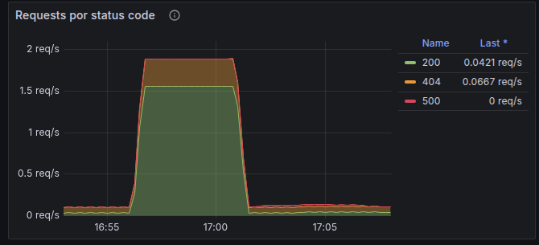
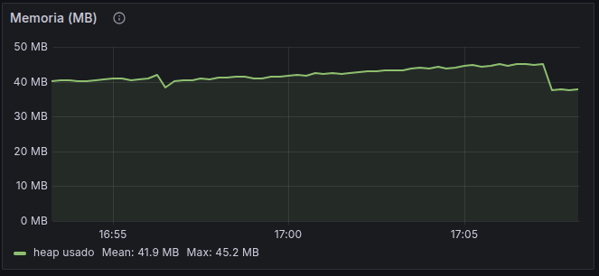
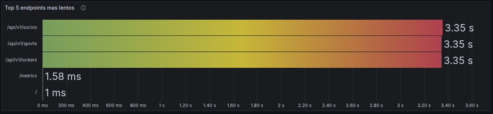

# Informe de Producción — Grupo 3

Este informe documenta la **verificación** del entorno productivo de AlentApp y las
**decisiones técnicas** adoptadas en las fases anteriores. Es la entrega de la **Fase 4**
del TP Integrador - Actividad 4.

Las verificaciones se ejecutaron sobre el stack levantado con
`docker compose -f docker-compose.prod.yml up -d`, con tráfico real generado contra la API.

---

## 4.1. Verificación técnica

Comparación de las imágenes y el runtime **antes** (entorno de desarrollo,
`docker-compose.yml`) y **después** (entorno productivo, `docker-compose.prod.yml`).

| Métrica | Antes (desarrollo) | Después (producción) | Mejora |
|---|---|---|---|
| Tamaño imagen API | **1.67 GB** (`alentapp-api:dev`) | **473 MB** (`alentapp-api:prod`) | **−71.7%**  |
| Tamaño imagen Web | **1.02 GB** (`alentapp-web:dev`) | **82.5 MB** (`alentapp-web:prod`) | **−91.9%**  |
| Tiempo de startup API | modo `tsx watch` (compila TS on-the-fly + `prisma migrate dev`): arranque en frío del orden de decenas de segundos | **~1.2 s** hasta *"Server listening"* (JS precompilado + `migrate deploy` sin migraciones pendientes) | arranque casi inmediato |
| Memoria API (idle) | — | **~64 MiB** / 512 MiB (RSS del contenedor); heap del proceso ~38 MB (gauge `process_memory_usage`) | dentro del límite (12.6%) |
| Endpoints accesibles | `:3000/api/v1/...` | `:3000/api/v1/socios`, `/sports`, `/lockers` → **HTTP 200** (con datos) | si |
| Frontend vía nginx | dev-server de Vite en `:5173` | `localhost/` (nginx en `:8080`→`:80`) → **HTTP 200**, sirve la SPA | si |

**Comandos de verificación usados:**

```bash
# Build de la imagen de la API
docker build -f packages/api/Dockerfile.prod -t alentapp-api:prod .
```

```bash
# Build de la imagen Web (VITE_API_URL se hornea en el build)
docker build -f packages/web/Dockerfile.prod --build-arg VITE_API_URL=http://localhost:3000 -t alentapp-web:prod .
```

```bash
# Tamaños de las imágenes
docker images alentapp-api:prod alentapp-web:prod
```

```bash
# Que NO haya herramientas de build en la imagen final (solo debe estar node)
# → tsc/npm/npx: NO-PRESENTE · node: /usr/local/bin/node
docker run --rm --entrypoint sh alentapp-api:prod -c 'which tsc npm npx node'
```

```bash
# Endpoint de la API (debe devolver 200)
curl -s -o /dev/null -w '%{http_code}\n' http://localhost:3000/api/v1/socios
```

```bash
# Frontend vía nginx (debe devolver 200)
curl -s -o /dev/null -w '%{http_code}\n' http://localhost/
```

---

## 4.2. Verificación de seguridad

Cada medida de seguridad fue confirmada sobre el contenedor en ejecución
(`alentapp-api-prod`).

| Medida | Verificación | Resultado |
|---|---|---|
| La API corre con usuario **no-root** | `docker exec alentapp-api-prod id` | `uid=1000(node) gid=1000(node)`  |
| **No** hay `npm`/`tsc`/`python` en la imagen final | `docker exec alentapp-api-prod sh -c 'command -v npm npx tsc python python3'` | todos **NO-PRESENTE** (solo `node`)  |
| **Read-only filesystem** activo | `docker exec alentapp-api-prod touch /test` | `Read-only file system` → falla  (y `/tmp` tmpfs es escribible) |
| **Capabilities mínimas** (`cap_drop: ALL`) | `docker exec alentapp-api-prod mount -t tmpfs none /mnt` | `permission denied` → bloqueado  |
| Variables sensibles vía **`.env`** (no hardcodeadas) | `docker-compose.prod.yml` usa `${POSTGRES_*}`, `${DATABASE_URL}`, etc. |  |
| **Healthchecks** funcionando | `docker compose -f docker-compose.prod.yml ps` | los **5** contenedores `healthy`  |

---

## 4.3. Verificación de observabilidad

Tráfico de prueba generado: **4368 requests** (3114 con `200`, 1000 con `404` y 254
con `500`), incluyendo errores 4xx deliberados (`/api/v1/socios/99999`) y errores 5xx
provocados bajando la DB mientras la API recibía tráfico.

| Check | Verificación | Resultado |
|---|---|---|
| OpenTelemetry exporta en `:9464/metrics` | `curl :9464/metrics` | **HTTP 200** |
| Métricas RED presentes | `http_requests_total`, `http_requests_errors_total`, `http_request_duration_{bucket,sum,count}`, `process_memory_usage` | si |
| Prometheus scrapea el endpoint OTLP | job `opentelemetry` → `api:9464` | **UP** (7 series)  |
| Grafana tiene datasource Prometheus | `GET /api/datasources` | `Prometheus` (default)  |
| Dashboard RED con 6 paneles | dashboard `RED — Alentapp API` (`uid=alentapp-red`) provisionado | **6 paneles** |
| Los gráficos responden al tráfico | ver tabla de valores ↓ | si |
| Las métricas de error reflejan los 4xx/5xx | `http_requests_errors_total` registró 1000 × `404` y 254 × `500` | si |

**Valores leídos de Prometheus durante la prueba** (las mismas queries PromQL que
alimentan cada panel del dashboard):

| Panel | Query (resumen) | Valor obtenido |
|---|---|---|
| 1. Requests/s | `sum(rate(http_requests_total[1m]))` | **~96.7 req/s** (pico de la ráfaga) |
| 2. Error % (5xx) | `sum(rate(...{status=~"5.."}[1m])) / sum(rate(...[1m])) * 100` | **~19%** pico (5.8% acumulado) durante la caída de la DB |
| 2b. Errores totales (4xx+5xx) | `sum(http_requests_errors_total)` | **1254** (1000 × `404` + 254 × `500`) |
| 3. Latencia p95 | `histogram_quantile(0.95, sum by(le)(rate(..._bucket[5m])))` | **≥2500 ms** (bucket tope saturado: caída de la DB) |
| 3. Latencia p99 | `histogram_quantile(0.99, ...)` | **≥2500 ms** (bucket tope saturado: caída de la DB) |
| 4. Por status code | `sum by(status)(http_requests_total)` | `200`: 3114 · `404`: 1000 · `500`: 254 |
| 5. Memoria (MB) | `process_memory_usage / 1024 / 1024` | **42.5 MB** (heap) |
| 6. Top 5 endpoints lentos | `topk(5, rate(..._sum[5m]) / rate(..._count[5m]))` | `/socios` **~42.5 s** (caída DB) · `/` 2.1 ms · resto sin tráfico en la ventana de 5 min |

> **Nota — inyección de errores 5xx:** para poblar el panel de errores se bajó la base
> (`docker compose -f docker-compose.prod.yml stop db`) mientras se enviaban requests a
> `/api/v1/socios`, que respondieron `500` (Prisma sin conexión: `getaddrinfo EAI_AGAIN db`).
> Durante esa ventana la latencia de `/socios` se disparó a segundos por el timeout de
> resolución/conexión, **saturando los buckets de p95/p99 en el tope de 2500 ms**. Al
> levantar la DB (`start db`) la API reconectó sola y volvió a responder `200`. Las
> métricas RED capturaron el incidente completo (subida de 5xx, pico de latencia y
> recuperación), que es exactamente el comportamiento que se busca observar.

---

## 4.4. Documentación de decisiones

### Arquitectura final



> El navegador llama a la API directamente en `:3000` (`VITE_API_URL` horneada en
> build). Grafana lee de Prometheus, que scrapea el endpoint OTLP de la API en `:9464`.
> La **db** no publica puerto al host: solo es accesible por la red interna.

- **web**: nginx unprivileged sirviendo la SPA estática (sin Node en producción).
- **api**: Fastify (JS precompilado), corre migraciones al arrancar, expone métricas
  RED en `:9464` vía OpenTelemetry.
- **db**: PostgreSQL 16, solo accesible por la red interna (no publica puerto al host).
- **prometheus** + **grafana**: stack de observabilidad provisionado por código.

### Decisiones técnicas

| Decisión | Por qué |
|---|---|
| **Multi-stage build** (API: `build`→`deps-prod`→`runtime`; Web: `deps`→`build`→`runtime`) | Saca el toolchain (`typescript`, `tsx`, `vite`, devDependencies) del artefacto final. Resuelve el problema #1 del análisis y logra la reducción de tamaño ≥70%. |
| **nginx** para el frontend (no Node en prod) | El dev-server de Vite no sirve para producción. nginx es liviano, rápido y pensado para servir estáticos; baja la imagen a 82.5 MB. |
| **nginx-unprivileged** en puerto 8080 | Corre como usuario no-root y en puerto no privilegiado, compatible con `cap_drop: ALL` y `read_only: true`. |
| **`read_only: true` + `tmpfs`** | Filesystem inmutable reduce la superficie de ataque; los pocos directorios de escritura (`/tmp`, cache de nginx) se montan como `tmpfs`. |
| **Usuario no-root** (`node`, `nginx`) | Ante un RCE el atacante no obtiene root del contenedor. Resuelve el problema #3 del análisis. |
| **Secrets vía `.env`** con `${VAR}` | Saca credenciales del repo (problema #2 del análisis), siguiendo *Config* de 12-Factor. |
| **OpenTelemetry + PrometheusExporter** | Estándar abierto que desacopla la instrumentación del backend; expone las métricas en formato Prometheus en `:9464`. |
| **Métricas RED vía hook global de Fastify** | En lugar de instrumentar controller por controller, un único `onResponse` captura `method`/`route`/`status` de **todas** las rutas. Menos código y sin riesgo de olvidar una ruta. |
| **Límites de recursos + healthchecks** por servicio | Evita que una fuga de memoria tire el host y permite a Docker saber si el servicio está listo. Resuelve el problema #5 del análisis. |

### Problemas encontrados

- **Poda de `node_modules` en la imagen de la API:** algunas dependencias hoisteadas
  por el monorepo (de `web` o tooling) eran seguras de borrar, pero otras
  (`valibot`, `remeda`, `effect`, `@prisma/dev`) las exige el **CLI de Prisma** al
  cargar `migrate deploy`. Quitarlas rompía el arranque con `MODULE_NOT_FOUND`. Se
  documentó en el Dockerfile qué se puede podar y qué no.
- **`read_only` vs. `npx`:** correr `prisma migrate deploy` con `npx` fallaba porque
  `npx` quiere escribir su cache en `/home/node/.npm`, incompatible con el filesystem
  de solo lectura. Se resolvió llamando al binario de Prisma **directo**
  (`node /app/node_modules/prisma/build/index.js`) sin `npx`.
- **Healthcheck con `localhost` (IPv6):** dentro del contenedor `localhost` resuelve a
  `::1` y los servicios escuchan en IPv4 → *connection refused*. Se usó `127.0.0.1`.
- **Target `alentapp-api` DOWN en Prometheus:** job redundante heredado del ejemplo
  del enunciado (apuntaba a `:3000/metrics`, que no existe). Resuelto eliminándolo;
  detalle en §4.3.

### Capturas de pantalla



**Paneles individuales:**

| Panel | Captura |
|---|---|
| 1. Requests/s (Rate) |  |
| 2. Error % / errores (Errors) |  |
| 3. Latencia p95/p99 (Duration) |  |
| 4. Por status code (200 vs 404) |  |
| 5. Memoria del proceso |  |

**Prometheus → Status → Targets** (único job `opentelemetry`, **UP**):



---

## Comandos de reproducción

Cada bloque **imprime** uno de los valores de las tablas de §4.1, §4.2 y §4.3:
ejecutalos en orden y copiá la salida a las estadísticas. Los números de §4.3
salen de leer las mismas queries PromQL del dashboard contra la API de Prometheus
(`/api/v1/query`), así que reflejan el tráfico real generado en el paso 3.

```bash
# 0. Build de las imágenes y arranque del stack productivo
export VITE_API_URL=http://localhost:3000
docker build -f packages/api/Dockerfile.prod -t alentapp-api:prod .
docker build -f packages/web/Dockerfile.prod --build-arg VITE_API_URL=$VITE_API_URL -t alentapp-web:prod .
docker compose -f docker-compose.prod.yml up -d
docker compose -f docker-compose.prod.yml ps          # §4.2 → los 5 servicios healthy
```

```bash
# 1. §4.1 Verificación técnica
docker images alentapp-api:prod alentapp-web:prod                      # tamaños de imagen (col. SIZE)
docker logs alentapp-api-prod 2>&1 | grep -i 'listening'              # "Server listening" (startup ~1.2 s)
docker stats --no-stream --format '{{.MemUsage}} ({{.MemPerc}})' alentapp-api-prod   # memoria RSS / 512 MiB
curl -s -o /dev/null -w 'API  /socios → %{http_code}\n' http://localhost:3000/api/v1/socios
curl -s -o /dev/null -w 'web  /       → %{http_code}\n' http://localhost/
```

```bash
# 2. §4.2 Verificación de seguridad
docker exec alentapp-api-prod id                                       # uid=1000(node) gid=1000(node)
docker exec alentapp-api-prod sh -c 'command -v npm npx tsc python python3 || echo NO-PRESENTE'
docker exec alentapp-api-prod touch /test            2>&1 || true      # Read-only file system → falla
docker exec alentapp-api-prod mount -t tmpfs none /mnt 2>&1 || true    # permission denied (cap_drop: ALL)
```

```bash
# 3. §4.3 Generar tráfico (incluye errores 4xx deliberados)
for i in $(seq 1 1000); do
  curl -s -o /dev/null http://localhost:3000/api/v1/socios
  curl -s -o /dev/null http://localhost:3000/api/v1/sports
  curl -s -o /dev/null http://localhost:3000/api/v1/lockers
  curl -s -o /dev/null http://localhost:3000/api/v1/socios/99999       # 404
done
```

```bash
# 3b. §4.3 Generar errores 5xx — se baja la DB y la API responde 500 sin conexión
docker compose -f docker-compose.prod.yml stop db
for i in $(seq 1 500); do
  curl -s -o /dev/null http://localhost:3000/api/v1/socios             # 500 (DB caída)
done
docker compose -f docker-compose.prod.yml start db                     # se vuelve a levantar la DB
until [ "$(curl -s -o /dev/null -w '%{http_code}' http://localhost:3000/api/v1/socios)" = 200 ]; do
  sleep 1                                                              # esperar reconexión a la DB
done
```

```bash
# 4. §4.3 Leer los valores (mismas queries PromQL que alimentan cada panel)
# Helper: imprime "valor <TAB> labels" de cada serie devuelta por Prometheus.
promql() { curl -s http://localhost:9090/api/v1/query --data-urlencode "query=$1" \
  | jq -r '.data.result[] | "\(.value[1])\t\(.metric)"'; }

promql 'sum(rate(http_requests_total[1m]))'                            # Panel 1 · Requests/s
promql 'sum(rate(http_requests_total{status=~"5.."}[1m])) / sum(rate(http_requests_total[1m])) * 100'  # Panel 2 · Error % (5xx)
promql 'sum(http_requests_errors_total)'                               # Panel 2 · errores totales (4xx+5xx)
promql 'histogram_quantile(0.95, sum by (le) (rate(http_request_duration_bucket[5m])))'  # Panel 3 · p95
promql 'histogram_quantile(0.99, sum by (le) (rate(http_request_duration_bucket[5m])))'  # Panel 3 · p99
promql 'sum by (status) (http_requests_total)'                        # Panel 4 · por status (200 vs 404)
promql 'process_memory_usage / 1024 / 1024'                           # Panel 5 · memoria heap (MB)
promql 'topk(5, rate(http_request_duration_sum[5m]) / rate(http_request_duration_count[5m]))'  # Panel 6 · top 5 lentos

# UIs:  Grafana http://localhost:3001 (admin/admin) → dashboard "RED — Alentapp API"
#       Prometheus http://localhost:9090 → Status → Targets (job opentelemetry, UP)
```

```bash
# 5. Bajar el stack
docker compose -f docker-compose.prod.yml down       # agregar -v para borrar volúmenes
```
